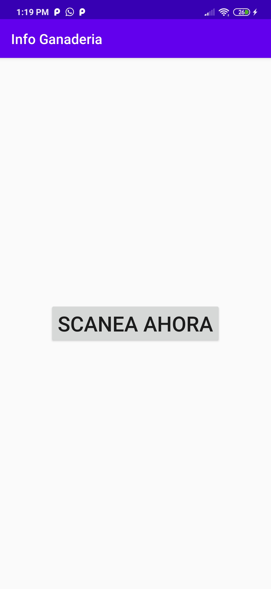

# Info Ganaderia
### Descripcion
_Pequeño proyecto elaborado en un curso de mi universidad llamado, aplicaciones moviles, el cual se propuso hacer una aplicacion mobil con las diferentes herramientas que vimos en clase, se eligio para hacer el proyecto, Android Studio._

* Info ganaderia es una aplicacion que contiene visualizaciones a otras paginas web en este caso https://todosobreganado.com (Ver en Gif 1), que a su vez contiene un menu elaborado de una manera minimalista y agradable de ver para el usuario
* Tiene una integracion con base de datos **Firebase**, la cual usa un sistema de Autentificacion por correo electronico. (posibilidad de Registrarse e iniciar sesion)
* Tiene integracion con **Google Maps**, los cuales proporcionan unos marcadores totalmente editables.
* Tiene un Scanner QR.

## Comenzando 🚀

[Click Aqui para ver Como Clonar el proyecto con AndroidStudio](https://desarrolloweb.com/articulos/importar-proyecto-desde-github-hacia-android-studio.html) 

Dale con **Confianza !** es Demasiado Sencillo ! (Recuerda que si el articulo anterior no te ayuda, puedes mirar tutoriales en google, o youtube de como hacerlo)

### Pre-requisitos 📋

Recuerda que necesitas **Firebase 🔥** para poder usar el proyecto en su maximo esplendor!

## Construido con 🛠️

_A continuacion las herramientas usadas para este proyecto_

* [Android Studio🛸](https://developer.android.com/studio) - Utilizado para el desarrollo
* [Firebase🔥](https://firebase.google.com) - BD para la autentificacion y almacenamiento

## Autores ✒️

* **Alejandro Becerra** - *Desarrollador* - [Linkeln](https://www.linkedin.com/in/alejandro-becerra-barco-/)

## Imagenes del proyecto 👀

**Menu Principal de la Aplicacion**

**Si seleccionas por ejemplo ir a "Noticias"**

### Algunas Caracteristicas de la aplicacion tienen limitadas funcionalidades, las cuales solo se pueden acceder despues de iniciar sesion.

**Por ejemplo despues de iniciar sesion, puedes ir a otras opciones, las cuales te despliegan otro nuevo menu**

**Menu Mapa**

**Menu Scanner QR**

